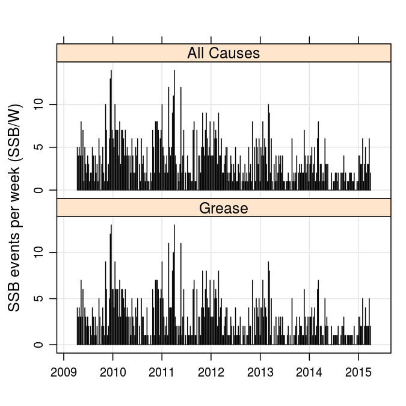
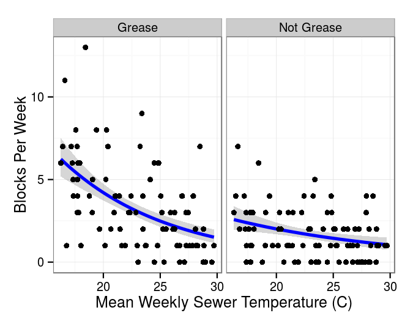
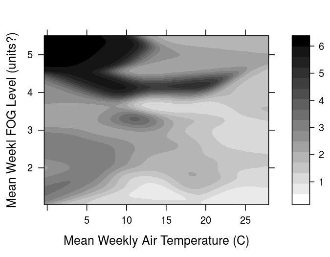
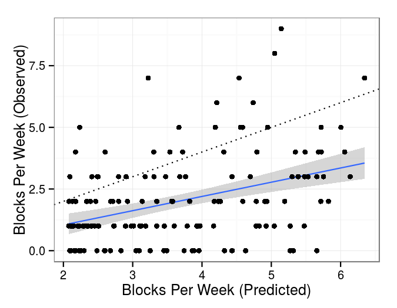
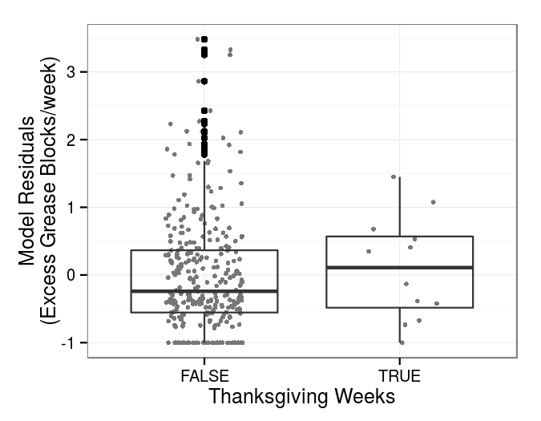
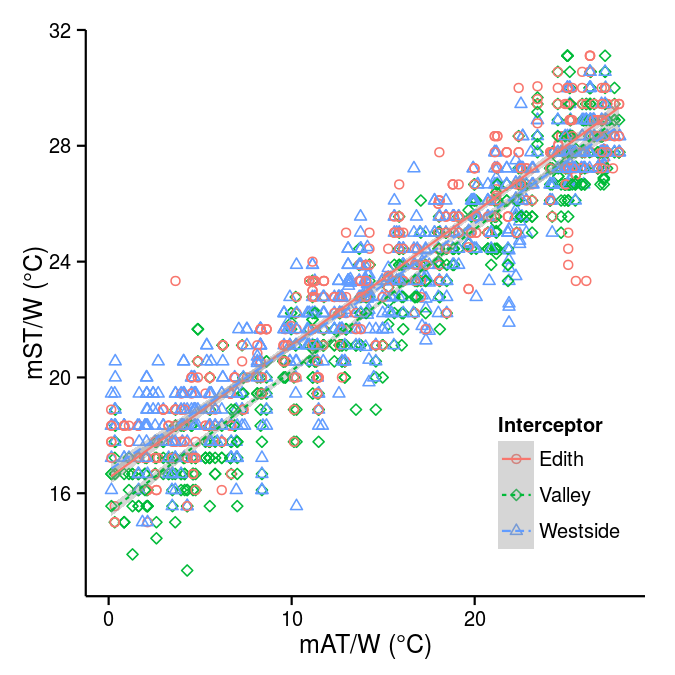
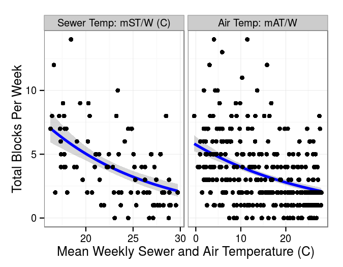
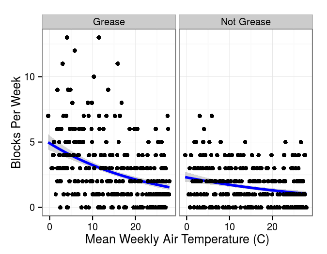
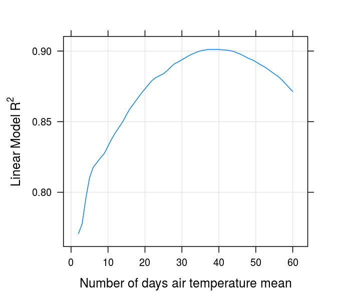

# Temperature-dependence in sewer blockage frequency
### Josh Nightingale, Christian Gunning and Mark Holstad
### Wed Mar  2 14:07:57 2016

# Methods

### Data
Albuquerque Bernalillo County Water Utility Authority (ABCWUA) responds to SSB events after discovery by maintenance workers or reports of blockages from the public. This study used an anonymised dataset of SSB dates, along with engineers' estimates of blockage cause. In total, 1104 SSB reports from the period 2009-04-06 to 2015-03-31 (inclusive) were used in this study.  For simplicity, we categorize all reported causes as either grease related or non-grease related.
The frequency of sanitary sewer blockages is the primary focus of this work.

As part of an unrelated ABCWUA system odor control survey, sewage temperature was obtained via grab samples by 
a chemical treatment vendor at 15 manholes on three treated north-south interceptors.  A map of these 
three interceptor is shown in Figure S1. Temperature measurements were obtained, typically bi-weekly, using a 
Cooper Atkins DPP400W Waterproof Pen Style thermometer with an accuracy range of +/- 1 C° (from -10° to 100°C) 
in a liquid sample collected from the manhole.  
In total, 1871 sanitary sewer temperature (ST) measurements from the period 2005-10-04 
to 2012-12-19 (inclusive) were used in this study.

Mean daily air temperature (mAT/D) was obtained from the Albuquerque International airport's (KABQ) automated METAR data collection system (available from \url{http://www.wunderground.com/history/airport/KABQ}) spanning the entire period of study noted above.

In addition, direct FOG measurements were available for 229 weeks. As with temperature measurements, these were averaged to calculate a mean weekly FOG level to use as a predictor of blockage frequency.

Since most days had no SSB events, the total number of SSB 
events per week (SSB/W) was computed and used in subsequent 
analysis. 
For comparison with SSB data, mAT/D measurements were averaged by week to yield mean weekly air temperature (mAT/W).
In addition, ST measurements were averaged by week (all interceptors were combined), 
yielding mean weekly SGST (mST/W).
In all analyses that included mST/W, weeks without ST measurements were excluded.
A time series of SSB events per week, for all causes and grease-related causes, is shown in Figure \ref{fig:blockts}.

<figure><figcaption>Figure 2: Blockage events per week, for all causes and grease-related causes.  Seasonality of both time series is evident. An exceptional spike of blockages in April 2011 follows a record-breaking cold spell in February 2011.  Likewise, the dearth in blockages in early 2014 and 2015 correspond with historic warm winters in those years.</figcaption></figure>

### Linear models
First, we seek to quantify the dependence of sewer temperature on air temperature using a set of linear models. Exploratory data analysis shows that manhole identity does not reliably covary with sewage temperature, while both interceptor identity and air temperature are significant predictors of sewage temperature.

To account for the lag between air temperature and sewer temperature, we compute the moving average of air temperature 
over a varying number of days N.  For each N, we fit a linear model (using a MANOVA model structure) that includes interceptor identity and N-day mean air temperature as predictors.  We then select N to maximize model $R^2$.

Next, we seek to quantify the dependence of blockage frequency on temperature.  We model blockage frequency using the Negative Binomial Generalized Linear Model (NB-GLM)\cite{hilbe2014}.  We start by considering blockages of all causes, and model their dependence on either sewage temperature or air temperature.  Due to the sparcity of sewage temperature data, we then focus on air temperature, and model blockages by both cause and the N-day mean air temperature.  Finally, we conduct a detailed analysis of the dependence of grease-caused blockages on N-day mean air temperature.

Note that standard R^2 statistics are not available for GLMs.  However, the proportional reduction in deviance (D) provides an analogous measure of the model's explanatory power \cite{zheng2000summarizing}. Thus D falls between 0 and 1, and can be approximately interpreted as the proportion of variance explained by the model.

All analysis was conducted with the R statistical programming environment \cite{cran}.

# Results

### Mean weekly air temperature (mAT/W) and sewage temperature (mST/W)

Overall, we found that air temperature, averaged over the preceding 40 days, was a very good
predictor of sewage temperature (Figure \ref{fig:sewweathplot}).
Indeed, the final model of sewage temperature versus air temperature and interceptor identity (Table \ref{tab:bestlin}) explained the majority of variation in mST/W (R^2 = 0.9012142).
 However, as air temperature falls below freezing, little further decrease in sewage temperatures was observed (Figure \ref{fig:sewweathplot}).

We further analysed the effect of local 
geography on linear model results.
In all high-ranked linear models, interceptor identity exhibits a small but statistically significant effect of on sewage temperature, while manhole identity was not a significant predictor.
Nonetheless, the effect size of either manhole and interceptor identity is small, and we do not consider local geographic effects further.

### Sewage temperature (mST/W), air temperature (mAT/W), and sewer blockage frequency (SSB/W)

We begin with an examination of all blockages, regardless of reported cause.
We modeled the response of sewer blockage frequency (SSB/W) to either air temperature (mAT/W) or sewage temperature (mST/W) using a NB-GLM.
Overall, we found that both sewage temperature and air temperature were weak but statistically significant predictors of  
sewer blockage frequency (Figure \ref{fig:multiblockplot}, 
Table \ref{tab:tempandblock}),
For the final models, we find that D = 0.154 (air temperature) and  D = 0.250 (sewer temperature). Thus, air temperature predicts approximately 15% of overall variation in weekly sewer blockage frequency.   

In the above models, sewer temperature appears to be a better predictor of blockage frequency than air temperature.
However, the two models are not directly comparable due to differences in sampling period. Sewage temperature measurements are expensive and labor-intensive, which in turn limits sample coverage.
Air temperature records, on the other hand, are freely available from automated weather stations worldwide, including all major airports.  Consequently, air temperature records cover the entire period of sewer blockage records.

### Causes of sewer blockage frequency (SSB/W)

Next, we explore the dependence of blockage frequency 
on reported blockage cause, grouped into grease versus not grease.  Again, we conduct separate analyses for air and sewage temperature using a set of NB-GLMs.

This dataset includes 884 total blockages where grease was the estimated blockage cause, representing 64.5\% of total incidents during the study period. We constructed a NB-GLM  using both air temperature (mAT/W) and blockage cause (grease vs not grease) as predictor variables.  Here, both air temperature and blockage cause are highly significant predictors of blockage frequency (Figure \ref{fig:block.airtemp} and Table \ref{tab:greasetab}). Again, there is a strong interaction between temperature and blockage cause, with grease-caused blocks responding more strongly to temperature.   The full model explains a sizable proportion of variation in blockage frequency (D = 0.183), particularly for grease-caused blockages (Figure \ref{fig:block.airtemp}A).

<figure><figcaption>Figure 3: Mean weekly sewer temperature predicts blockages caused by grease (D=0.257), and is a poor predictor of blockages due to other causes (D=0.080). Models include 90 weeks total. See Table ?? for model details.</figcaption></figure>

### The role of FOG

Blockages were most frequent in weeks which had both high levels of FOG and low mean air temperatures (Figure \ref{fig:fogcont}). However, this model explained a similar amount of deviance (D = 0.186) to a model containing only temperature and blockage cause as predictors of blockages during the same weeks (D = 0.181). The addition of FOG to the model resulted in a change of only 1.4579133 AIC units, whereas an extra parameter should result in a decrease of at least 2 units to be considered an improvement \cite{Arnold2010}. Furthermore, FOG level was not a significant term in this model, nor in models predicting only grease-caused or other blockages (all p > 0.05).

There was no significant seasonal trend in FOG levels, as shown by the non-significance of a quadratic model of the dependence of recorded FOG level on the day of year or that record. Similarly, there was no significant relationship with temperature.

<figure><figcaption>Figure 4: The highest number of blockages (shown by dark areas on the contour plot) occurs when levels of FOG are high, and air temperatures are low.</figcaption></figure>

### Model validation

Model validation was conducted by subdividing the
period of record. We tested the model of grease blockage frequency's dependence on air temperature, as this had high predictive value while using a minimal amount of easily-obtained data.

The response of weekly grease blockage 
frequency to air temperature was fit using observations prior
to 2012-04-12 (157 weeks).  The resulting model was 
used to predict grease blockage frequency in the weeks after
2012-04-12 (156 weeks).  The results, shown in Figure \ref{fig:validate}, indicate that model predictions generally capture the observed 
pattern of grease blockage frequency.

<figure><figcaption>Figure 5: Model validation comparing predicted and observed weekly grease blockage frequency. To generate predictions, a model was fit using weeks prior to 2012-04-12 (157 weeks total).  Observed air temperatures in subsequent weeks (156 weeks total) were used to predict grease blockage frequency (X-axis). Also plotted are the observed grease blockage frequencies in those weeks (Y-axis). The dotted line is the identity line y = x, and the solid line shows the linear relationship between observed and predicted blockages (y = 0.58x -0.11).</figcaption></figure>

### Holiday FOG?

Using residuals from the model of blockage frequency by air temperature and cause,
we tested the hypothesis that the holiday period causes extra blockages 
via the addition of extra fats and grease to the drainage system.
Figure \ref{fig:tday} compares model residuals from the weeks containing and immediately after Thanksgiving with other weeks, isolating any difference in blockage frequency during this period once temperature is taken into account.

<figure><figcaption>Figure 6: Once air temperature is accounted for, the weeks containing and following Thanksgiving show no evidence of elevated frequencies of grease-caused blockages.</figcaption></figure>

# Discussion

We have demonstrated a significant, conserved pattern of 
FOG-caused blockages in response to sewer and air 
temperature in 
the city of Albuquerque, New Mexico.   The city of Albuquerque has a number of unique geographic and climactic features, 
including large yearly temperature swings, highly variable precipitation, a significant 
within-system elevation gradient, and extensive cold air 
drainage.  Whether our results will hold in other locales
remains an intriguing question.  The ready 
availability of automated air temperature records
suggests that the analyses presented here could easily be 
replicated in other cities where sanitary sewer blockage
data is routinely collected.  A comparison between cities
from a range of climates and topographies could provide valuable evidence on empirical patterns of FOG blockages.

We find that mean air temperature has
only modest utility in predicting sewer blockages over
weekly timescales. Nonetheless, an increased 
understand of the drivers of SSOs in general, 
and FOG-related blockages in particular, 
could aid in system design and maintainence.   
Consideration could be given in sewer design
to select locations subject to higher winter temperatures,
either through greater depth or under asphalt pavement.
Similarly, cleaning operations could be prioritized to areas
expected to experience coldest temperatures.

Our results suggest that sewer temperature provides a
somewhat more accurate predictor of blocking frequency than 
air temperature. In
systems where these data are regularly collected and made
available to managers, such data could potentially be used
anticipate problems in sanitation infrastructure and plan
system maintenance.

We note that sewage temperature is driven primarily by soil
temperatures (author’s communication with Dr. Jes
Vollertsen, 2014), and a body of literature on the
prediction of soil temperature from air temperature in
non-urban areas exists (e.g., \cite{Hasfurther1972}). The
relationship between air and soil temperature is likely to
be mediated by groundwater levels. Differences in the
response of sewer temperature to air temperature between
interceptors and manholes likely reflects elevation and land
use, possibly via their effects on groundwater temperature.
Models including precipitation patterns and/or local
physical characteristics (e.g. water table height, land use,
sewer configuration, soil type, geology) could test this
hypothesis. 

Because lower air and soil temperatures occur 
coincidental to the
Thanksgiving and Christmas season in the Northern
Hemisphere, it is possible that FOG related SSOs increase
during the holiday season but not due to higher levels of
holiday generated FOG. 
Indeed, we find no excess blockage frequency in Thanksgiving weeks.  Further study of SSO rates versus
holiday seasons in Southern Hemisphere cities could further
test this hypothesis.

Our results also suggest that areas experiencing
increasing average temperatures due to climate change may
experience an overall reduction in blockage frequencies over time.
Indeed, large-scale climatic trends could serve as natural
experiments to study the impact of temperature on long-term
(e.g. yearly) blockage frequencies.

With continuing population rise and urbanisation, efficient
operation of urban waste-water infrastructure is an
increasingly important issue for global public health.
\cite{Sato2013} recently highlighted the importance of more
research into efficacy of waste-water treatment techniques,
particularly in the developing world. The sewer blockage 
and temperature data presented here
were collected during routine system monitoring in the 
course of standard operations.  We hope this work 
demonstrates the
potential usefulness of historic datasets 
in addressing modern (and future) urban infrastructure challenges.

# Tables
??Need table numbers.

<!-- html table generated in R 3.2.3 by xtable 1.8-0 package -->
<!-- Wed Mar  2 14:10:54 2016 -->
<table border=1>
<caption align="bottom"> Weekly mean sewage temperature and blockage cause predict weekly blockage frequency ( NB-GLM, n=90 weeks, D=0.281) </caption>
<tr> <th>  </th> <th> Estimate </th> <th> Std. Error </th> <th> z value </th> <th> Pr(&gt;|z|) </th>  </tr>
  <tr> <td align="right"> (Intercept) </td> <td align="right"> 3.5661 </td> <td align="right"> 0.3996 </td> <td align="right"> 8.92 </td> <td align="right"> 0.0000 </td> </tr>
  <tr> <td align="right"> SewTempC </td> <td align="right"> -0.1063 </td> <td align="right"> 0.0180 </td> <td align="right"> -5.92 </td> <td align="right"> 0.0000 </td> </tr>
  <tr> <td align="right"> variableNot Grease </td> <td align="right"> -1.5517 </td> <td align="right"> 0.6451 </td> <td align="right"> -2.41 </td> <td align="right"> 0.0161 </td> </tr>
  <tr> <td align="right"> SewTempC:variableNot Grease </td> <td align="right"> 0.0405 </td> <td align="right"> 0.0287 </td> <td align="right"> 1.41 </td> <td align="right"> 0.1590 </td> </tr>
   
</table>

<!-- html table generated in R 3.2.3 by xtable 1.8-0 package -->
<!-- Wed Mar  2 14:10:54 2016 -->
<table border=1>
<caption align="bottom"> Weekly mean air temperature and blockage cause predicts weekly blockage frequency ( NB-GLM, n=313 weeks, D=0.183) </caption>
<tr> <th>  </th> <th> Estimate </th> <th> Std. Error </th> <th> z value </th> <th> Pr(&gt;|z|) </th>  </tr>
  <tr> <td align="right"> (Intercept) </td> <td align="right"> 1.5953 </td> <td align="right"> 0.0823 </td> <td align="right"> 19.39 </td> <td align="right"> 0.0000 </td> </tr>
  <tr> <td align="right"> MeanTempC </td> <td align="right"> -0.0418 </td> <td align="right"> 0.0053 </td> <td align="right"> -7.89 </td> <td align="right"> 0.0000 </td> </tr>
  <tr> <td align="right"> variableNot Grease </td> <td align="right"> -0.7651 </td> <td align="right"> 0.1297 </td> <td align="right"> -5.90 </td> <td align="right"> 0.0000 </td> </tr>
  <tr> <td align="right"> MeanTempC:variableNot Grease </td> <td align="right"> 0.0137 </td> <td align="right"> 0.0083 </td> <td align="right"> 1.66 </td> <td align="right"> 0.0973 </td> </tr>
   
</table>

# References

# Supplemental Information

<figure><figcaption>Figure 7: Sewage temperature (mST/W) increased with air temperature (mAT/W). The response of sewage temperature to air temperature differed slightly between sewer system interceptors, See Table 
ef{tab:bestlin} for model details (R^2 = 0.90)</figcaption></figure>

<figure><figcaption>Figure 8: Mean weekly sewage temperature (n=90 weeks, D=0.281) and mean weekly air temperature (n=313 weeks, D=0.183) are both statistically significant predictors of sanitary sewer blockage frequency in Albuquerque, NM. Here, blockages of all causes are shown.  Note that sewer temperature is only available for select weeks, while air temperature is available for the entire period of blockage record.</figcaption></figure>

<figure><figcaption>Figure 9: Mean weekly air temperature predicts blockages caused by grease (884 total blocks, D=0.148), and is a poor predictor of blockages due to other causes (487 total blocks, D=0.055). 313 weeks total. See Table ?? for model details.</figcaption></figure>

<figure><figcaption>Figure 10: Goodness-of-fit profile of linear model predicting sewer temperature from mean air temperature.  For a range of N, air temperature was averaged over the N days preceding each sewer temperature sample.  N = 40 yields the best model, with $R^2$ = 0.90. Note that results are not highly sensitive to N, with 30 < N < 50 all yielding good models.</figcaption></figure>

<!-- html table generated in R 3.2.3 by xtable 1.8-0 package -->
<!-- Wed Mar  2 14:10:58 2016 -->
<table border=1>
<caption align="bottom"> Summary table of the model of the response of mean weekly sewage grab sample temperature (MW-SGST) to mean weekly mean daily air temperature (MW-MDAT). Sewer interceptor identity has a significant effect on model intercept. $R^2 = 0.90$. </caption>
<tr> <th>  </th> <th> Estimate </th> <th> Std. Error </th> <th> t value </th> <th> Pr(&gt;|t|) </th>  </tr>
  <tr> <td align="right"> (Intercept) </td> <td align="right"> 16.5 </td> <td align="right"> 0.0796 </td> <td align="right"> 207.960 </td> <td align="right">    0 </td> </tr>
  <tr> <td align="right"> MeanTempC </td> <td align="right"> 0.457 </td> <td align="right"> 0.00351 </td> <td align="right"> 130.160 </td> <td align="right">    0 </td> </tr>
  <tr> <td align="right"> InterceptorValley </td> <td align="right"> -0.73 </td> <td align="right"> 0.0775 </td> <td align="right"> -9.418 </td> <td align="right"> 1.31e-20 </td> </tr>
  <tr> <td align="right"> InterceptorWestside </td> <td align="right"> -0.233 </td> <td align="right"> 0.0742 </td> <td align="right"> -3.145 </td> <td align="right"> 0.00168 </td> </tr>
   
</table>
